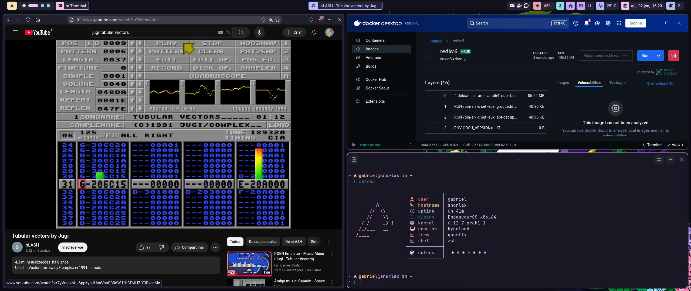
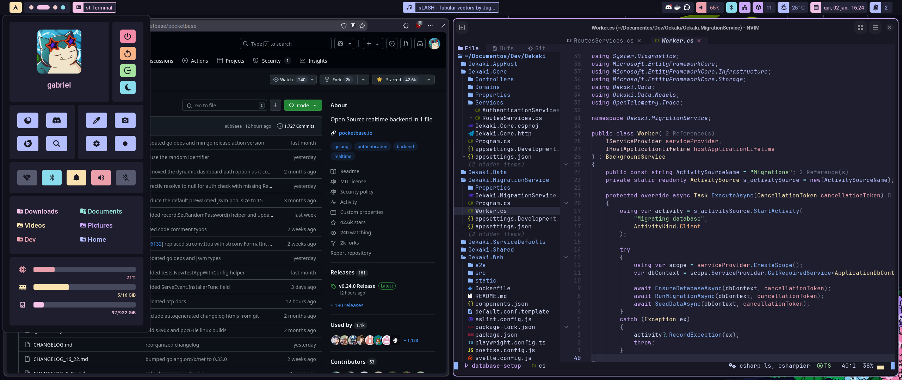
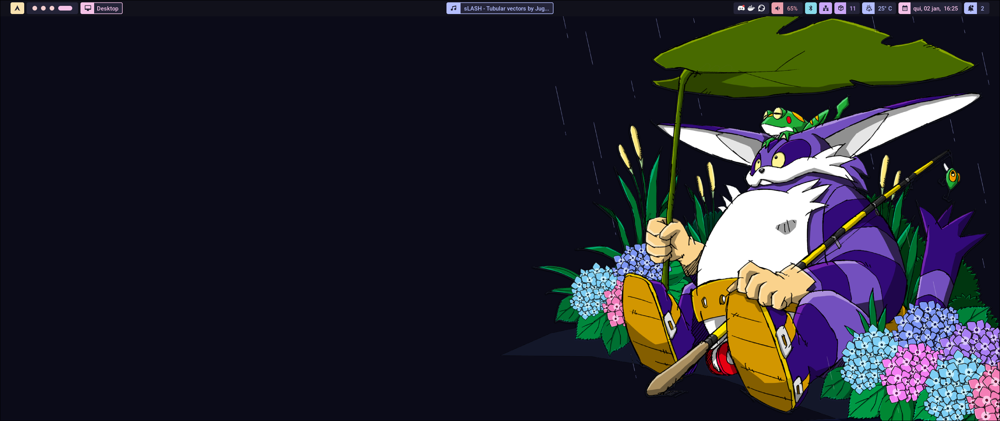

# lake-hyprland-dotfiles

My personal dotfiles for Hyprland. This is still very early, so some things might be missing.
Maybe I should make a script for autoinstalling some of these.

<p align="center">







</p>

## Packages/dependencies

These dotfiles are symlinked using `stow`, so there is not a need to keep copying, having duplicates, or moving them manually.
If you have never used Stow before, check out [this video by Dreams of Code](https://youtu.be/y6XCebnB9gs).

### Hyprland

- `hyprland`, obviously
- idle behavior: `hypridle`
- lockscreen: `hyprlock`
  - Original by [MrVivekRajan's Hyprlock-Styles](https://github.com/MrVivekRajan/Hyprlock-Styles) (style 9 specifically)
  - Adapt some strings for your language (e.g. "Senha" -> "Password")
- wallpaper management: `hyprpaper`
- top bar: `hyprpanel` (will bring some stuff, like a "dashboard", workspace indicator, clock, bluetooth status, etc.)
- color picker: `hyprpicker`
- app launcher: `rofi`
- notification daemon: `dunst`
- cursor util: `hyprcursor`

### Terminal and shell

- terminal: `ghostty`
- shell: `zsh`
- prompt: `starship`
- editors: `nvim`, Visual Studio Code, IntelliJ IDEA, Rider

## ZSH plugins

- `zsh-autosuggestions`
- `zsh-syntax-highlighting`
- `zsh-you-should-use`

P.S: I am on Endeavour OS (Arch, btw), which means plugins can be installed directly through Pacman or
your preferred AUR helper (like `yay`), then pointing to the plugin on the `.zshrc` file:

```bash
source=/usr/share/zsh/plugins/<plugin-name-here>
# ...
```

### Others

- theme: Catppuccin Mocha Mauve
- fonts
  - sans-serif: Roboto
  - monospaced: JetBrains Mono (with the Nerdfonts patch)
- cursor: [Colloid (dark) by vinceliuice](https://github.com/vinceliuice/Colloid-icon-theme/tree/main/cursors)
- browsers: `zen-browser`, Firefox
- clipboard management: `wl-clipboard`
- backlight management: `brightnessctl` and `ddcutil`
- screenshoting: `grim` and `grimshot`

## TO-DO

- [ ] Properly configure my own Rofi (at the moment I am using someone else's config)
- [ ] Use my own hyprlock style
- [ ] Zen Browser and Firefox `userChrome`
- [x] ~Use `hyprcursor`~
- [ ] Better descriptions on some files
- [ ] Tweak some of the GTK Catppuccin theme
- [ ] Properly link all mentioned projects in this markdown file
- [ ] Maybe an autoinstall script?
- [x] ~Screenshots~
